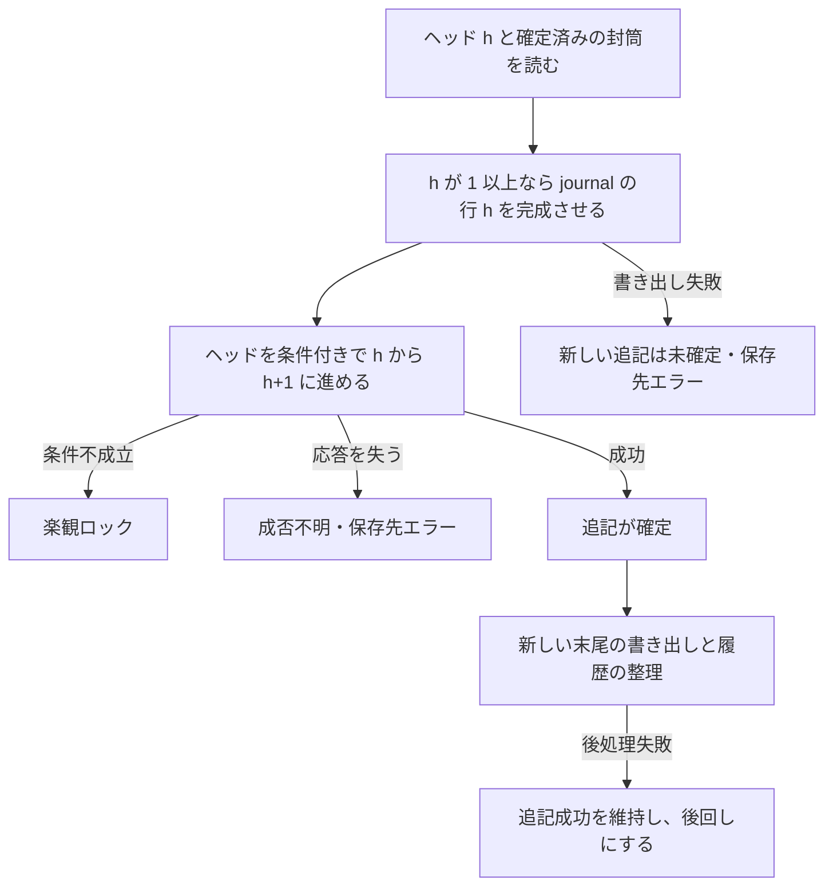

# Bigtable ストレージプロファイル（草案）

[共通契約](../core-contract.md)の確定点を、ヘッド 1 行の条件付き更新に置く。ヘッドから置き換わる直前のイベントを、先にジャーナルへ書き出す。読み取りは、ジャーナルと取得済みヘッドの末尾イベントを合わせて行う。

> 2026-10-04 作成。P-28・P-29・P-30〜P-35 と ADR-0005・0006 を前提とする。BT-D1〜D5・BT-D6a・BT-D6b・BT-D7 は同日に合意した（1 章、[履歴配置の ADR-0007](../../adr/0007-store-bigtable-snapshot-history-with-events.md)、[封筒の保存形式の ADR-0008](../../adr/0008-fix-bigtable-envelope-binary-format.md)）。草案と表示した BT 規則の具体的な実現方法は、引き続き確認対象である。ヘッドだけを先に進める現行実装の追認ではない。実装者は 1〜6 章の確定・読み取り・回復を先に確認する。用語は [CONTEXT.md](../../../CONTEXT.md) に従う。

## 1. ヘッドは小さく保ち、履歴はジャーナルの行に置く

| 判断 | 採用した案 | 主な代案 | 状態 |
|:--|:--|:--|:--|
| BT-D1 | 外部の初期化手順で journal・head の 2 テーブルと同じ store_id の設定項目を事前に用意する。ライブラリは照合し、欠損・不一致を拒否する | 生成時に両テーブルを自動初期化 | 合意（2026-10-04） |
| BT-D2 | イベントの行に、その追記のスナップショット履歴も置く。履歴の削除済みの印を残す | ヘッドの固定スロットに最新 n 件を置く、履歴を別テーブルへ写す | 合意（2026-10-04）、ADR-0007 |
| BT-D3 | 稼働中の全操作を同じクラスタへ固定し、単一行トランザクションを許可する。障害中は保存先エラーを返し復旧を待つ | 書き手の停止・複製確認・再開を含むクラスタ切替も設計する | 合意（2026-10-04） |
| BT-D4 | 最初の配置では履歴の即時削除だけを提供する。イベントと削除済みの印を残し、保持処理の失敗でも追記成功を維持する | 期限切れ方式も加え、別の列ファミリへ印付き履歴を移して GC で取り除く | 合意（2026-10-04） |
| BT-D5 | head の Change Streams による変更フィードを任意で提供する。購読位置の保存・重複除去・期限切れ後の再同期を行う | 最初の版では変更フィードを提供しない | 合意（2026-10-04） |
| BT-D6a | 封筒の保存形式を、4 章の固定バイナリ形式にする。整数・項目順・長さを全言語で固定し、形式の変更は版番号で管理する | JSON、Protocol Buffers | 合意（2026-10-04）、ADR-0008 |
| BT-D6b | メタデータ込みの 1 封筒の上限をストア単位に設定する。既定は 1MiB、最大は 8MiB。両テーブルに記録し、クライアント間の不一致を拒否する | 固定の 1MiB、固定の 8MiB | 合意（2026-10-04） |
| BT-D7 | ヘッドを進める前に、直前の確定済みイベントと必要な履歴の書き出しを確認する。確認できなければ、新しい追記は保存先エラーにする | ヘッドに複数件の未書き出しデータを保持する方式を設計する | 合意（2026-10-04） |

BT-D6 は、保存形式とサイズ上限を独立して確認するため、BT-D6a・BT-D6b に分けた。

BT-D7 の合意により、直前の確定済みデータの書き出しを確認できない間は、次の追記を確定させない。その書き手はヘッドを進めず、保存先エラーを返す。読み取りは書き出しを要求せず、journal と取得済みヘッドの末尾を合わせる。確定後の書き出しや保持処理の失敗は、既に成功した追記の結果を変えない。

固定スロット案は、保持件数 n と封筒サイズの積が行サイズに収まる必要がある。別テーブル案は、履歴のコピーの失敗や遅れに対する追加の回復・索引の手順が要る。BT-D2 の合意により、ジャーナル行への原子的な書き出しと、消さないイベントセルを使って履歴の再作成を防ぐ案を採用する。保持処理では集約のジャーナル範囲を調べる費用が掛かる。

## 2. 同じクラスタを読み書きの経路にする

- **必須 BT-1**: 稼働中の読み取り・書き込み・保持・設定照合は、同じクラスタへ固定した app profile を使う。単一行トランザクションを許可する。複製用のクラスタを置く構成でも、アダプタの操作先はこのクラスタにそろえる。利用クラスタの障害中は保存先エラーを返して復旧を待つ。複数クラスタへの同時書き込み、マルチクラスタルーティング、自動フェイルオーバーは範囲外で、計画的な切替の手順は別途設計する（SP-1、2026-10-04 合意、BT-D3）。[条件付き書き込み](https://cloud.google.com/bigtable/docs/writes) は、この経路で 1 行の確認と更新を原子的に行う。
- **草案・必須 BT-2**: journal の `event`・`history`、head の `head`・`snapshot`、両テーブルの `config` の列ファミリを事前に作る。データの列ファミリには年齢による GC を設定しない。版数の GC は最大 1 にするが、読み取りでも 1 列 1 セルに限定する。GC の遅れに正しさを依存させない（[GC の仕様](https://cloud.google.com/bigtable/docs/garbage-collection)）。

設定行のキーは 1 バイトの `0x00` とする。データ行のキーは 3 章の形なので、この設定行と完全一致しない。`config:metadata` に UTF-8 の JSON オブジェクトを保存し、`store_id`（小文字の UUID 文字列）、`layout_version`（整数 1）、`keep_snapshot_count`、`retention_mode`（文字列 `delete`）、`envelope_limit_bytes` を持たせる。BT-D6b の合意により、封筒の上限はバイト数の整数で、既定 1048576、最大 8388608 とする。保持件数は、なしなら null、設定する場合は正の整数の 10 進文字列とし、指数表記や先頭のゼロを使わない。JSON 数値の浮動小数点への変換を避けるためである。

BT-D1 の合意により、初期化は書き手がいない状態で外部手順が行う。両テーブルと設定をそろえてから書き手を動かす。通常のストア生成では両方の設定を強整合で読み、フィールドの型と値を比較する。JSON のキーの順序や空白は比較しない。必須フィールドの欠損、重複した JSON キー、不一致は設定エラーにする。片方だけ欠けた設定を自動で補わない。設定の具体的な保存形式とフィールドは、この草案の案である。

保持件数・保持方式はストア単位でそろえ、異なる設定の書き手を同時に動かさない。保持件数の変更では、7 章の設定変更手順で既存履歴を整理してから、両テーブルの設定を更新する。BT-D5 の合意により、変更フィードは任意の能力として提供する。フィードを使うストアでは head だけに Change Streams を設定し、クラスタと保持期間を照合する。使わないストアでは有効化を要求しない。

## 3. 長さを含むキーで、別の集約の範囲と重ならないようにする

`A` は aid の UTF-8、`H` は [FNV-1a 64](hash.md) の 8 バイトのビッグエンディアンとする。`L16` は A のバイト長を符号なし 16bit のビッグエンディアンにした値である。

```text
P(aid)             = H(aid) || L16(length(A)) || A
head の行キー      = P(aid)
journal の行キー   = P(aid) || U64BE(seq_nr)
```

- **草案・必須 BT-3**: aid の組み立て・型名・長さは T-1・T-11・T-12 に従う。長さを含めるので、ハッシュが衝突しても別の aid の P は前方一致にならない。aid に `#`、NUL、日本語が含まれても、そのバイト列を区切り文字として解釈しない（SP-2）。
- **草案・必須 BT-4**: seq_nr は 8 バイトの符号なしビッグエンディアンにする。行キーの順序は seq_nr の順序と一致する。範囲を作るときに 10 進文字列、言語の Display、`prefix + 0xff` を使わない。

ヘッド位置 h のイベント取得で `start = max(1, seqNr) < h` の場合だけ、開始を `P || U64BE(start)`、終了を `P || U64BE(h)` の排他的境界として journal の範囲を作る。この範囲に h は入れず、h の封筒は取得済みヘッドから足す。head がない場合、start > h の場合、start = h の場合の分岐は、範囲を作る前に行う（6 章）。

## 4. 封筒と履歴の削除状態を固定する

BT-D6a の合意により、封筒はライブラリが次のバイト列として組み立てる。先頭の `0x01` は形式の版番号である。payload に渡すシリアライザはペイロードだけを扱う（T-7）。`U16`・`U32`・`U64` はビッグエンディアン、`I64` はビッグエンディアンの符号付き 64bit の 2 の補数とする。

```text
イベント = 0x01 || U16(aid の長さ) || aid の UTF-8 || U64(seq_nr)
          || I64(occurred_at_ns) || U32(manifest の長さ) || manifest の UTF-8
          || U32(payload の長さ) || payload
スナップショット = 0x01 || U64(seq_nr)
                  || U32(manifest の長さ) || manifest の UTF-8
                  || U32(payload の長さ) || payload
```

長さはバイト数である。未使用の末尾、長さ不一致、未知の形式版は保存先エラーにする。正しい封筒の payload の復元に失敗した場合は直列化エラーにする。イベントの occurred_at_ns と seq_nr は共通契約の範囲を検査する。

| テーブル・セル | 値 |
|:--|:--|
| head / `head:seq_nr` | 20 桁のゼロ詰め ASCII 数字。ヘッドの照合に使う |
| head / `head:last_event` | その seq_nr のイベント封筒 |
| head / `head:has_snapshot` | その追記がスナップショットを伴うなら ASCII の `1`、イベントだけなら ASCII の `0` |
| head / `snapshot:current` | 現在のスナップショット封筒。ない場合はセルもない |
| journal / `event:envelope` | その行キーの seq_nr のイベント封筒。削除しない |
| journal / `event:has_snapshot` | head と同じ ASCII の `1` または `0`。書き出しの検証に使い、削除しない |
| journal / `history:state` | ASCII で、保持対象を初めて書き出したときは `active`。削除した後は `retired` |
| journal / `history:envelope` | 履歴のスナップショット封筒。`retired` にしたときに削除する |

保持件数を設定していない場合は history のセルを作らない。`has_snapshot = 1` の head では、snapshot:current の seq_nr が head の seq_nr と一致する。イベントだけの追記では、現在のスナップショットを保存したまま `has_snapshot = 0` にする。

- **草案・必須 BT-5**: journal 行の新規作成は、`event:envelope` がない場合だけ、イベント・フラグ・必要な履歴を 1 回の CheckAndMutateRow で書く。既存行は上書きせず、イベントとフラグを照合する。履歴を伴う行が active なら、保存されたスナップショット封筒も取得済みの値と照合し、欠損・不一致を保存先エラーにする。`history:state = retired` の行の履歴を再作成しない。イベントセルの存在が、遅れた書き出しによる履歴の再作成を防ぐ印になる。
- **草案・必須 BT-6**: journal の初回作成のセル時刻は固定値 0µs とする。head の更新では、置き換える列の全版を削除してから新しい値を同じ原子的な操作で書く。保持の state 更新も同じ形にする。CAS のフィルタは対象の列の最新 1 セルに限定してから値を照合し、過去の seq_nr や active のセルに一致させない。

セル時刻は Bigtable の管理用であり、occurred_at には使わない。[Bigtable の時刻指定](https://cloud.google.com/bigtable/docs/writes) はマイクロ秒の値でミリ秒精度までなので、ドメインのナノ秒は封筒の I64 に保存する。

- **必須 BT-16**: メタデータを含む直列化後の 1 封筒に、ストア単位のサイズ上限を設ける。既定 1MiB、最大 8MiB とする。値は両テーブルの設定項目に記録し、クライアントが使う値と照合する。不一致は設定エラーにする。最小の封筒も収まらない値や、最大を超える値も設定エラーにする。上限を超える入力は書き込み前に、規則 BT-16 と関係する seq_nr を含む契約違反として拒否する（2026-10-04 合意、BT-D6b）。設定変更はストアを使う全クライアントを止めて外部で行い、再生成時に照合する。

ヘッドには全イベントや n 件の履歴を置かない。イベント封筒・現在のスナップショット・固定のメタデータだけなので、n が増えてもヘッド行は育たない。上限の案は [行・セルの推奨サイズ](https://cloud.google.com/bigtable/quotas) より小さく保つための判断であり、Bigtable 自体の必須上限と同じ意味ではない。

## 5. 直前のイベントを書き出してから、ヘッドを進める

- **草案・必須 BT-7**: 入力検査と直列化を済ませてから、次の順に実行する。

1. head の対象行を強整合で読む。行がなければ h=0、あれば h と最後の封筒を検証する。必要なセルが欠けた行を、新規集約とみなさない。
2. W-3・W-8 で入力の seq_nr を照合する。h に対して正しい次の追記だけ続ける。
3. h>0 なら、取得した最後のイベント h を BT-5 で journal へ書き出す。保持件数があり、取得した head が `has_snapshot=1` なら、同じ行にそのスナップショット h も初回作成する。書き出しを確認できなければ保存先エラーにし、ヘッドを進めない。
4. head の CheckAndMutateRow を実行する。新規作成は seq_nr 列が存在しない側で初期化する。更新は seq_nr が取得した h の側だけで、新しい seq_nr・イベント封筒・has_snapshot を書く。スナップショットを伴う場合は current も同じ操作で置き換える。**この操作の成功が追記の確定点**である（H-1）。
5. 新しい末尾イベントを journal へ書き出し、履歴の保持処理を試みる。失敗は通知して後回しにする。確定した追記を失敗として返さない。

更新の CAS が不成立なら、取得した h の後に別の書き込みが確定したので楽観ロックにする。新規作成の CAS が先行する作成に負けた場合も同じである。CAS の結果を受け取れなかった場合は、成否不明の保存先エラーにする。SDK の自動再送で不成立になったことを、元の操作の未確定の証拠に使わない。



手順 3 は、確定済みのジャーナルをヘッドの置き換えから守るための必須の書き出しである（2026-10-04 合意、BT-D7）。手順 5 の古い履歴の整理とは区別する。履歴を同じ journal 行に書く場合も、その行の原子的な初回作成に含める。履歴だけを別 RPC で書き、失敗したまま最後のスナップショットを上書きする手順は採らない。

### 常に、h より前は journal にあり、h は head にある

最初の確定では h=1 の封筒が head にある。h から h+1 へ進む前に h の行を完成させるので、確定済み head が h のときは 1〜h−1 が journal にある。この性質を、イベントだけの追記でも守る。

スナップショットを伴った追記 s も、次の追記の前に seq_nr=s の journal 行へ書き出される。まだ書き出されていない最新 s=h は head の current にある。このため、別行の履歴コピーが失敗して過去のスナップショットを失う手順を避けられる。

## 6. ヘッドを先に取得し、その末尾を読み取り結果に足す

- **草案・必須 BT-8**: 最新スナップショットは 1 回の head 行の読み取りで取得する。head と current の必要な列を同じ ReadRows の行から復元する。R-2 の組は原子的で、snapshot.seq_nr は h 以下である（R-8）。snapshot がなくても h と「スナップショットなし」を返す。
- **草案・必須 BT-9**: イベント取得では最初に head の h とイベント h の封筒を取得し、以後もその値を使う。`start = max(1, seqNr)` とし、journal の RowRange を作る前に次のように分岐する。
  1. head がない（h=0）、または start > h なら、空のイベント列を返す。journal の ReadRows は要求しない。
  2. start = h なら、取得済みの h の封筒だけを返す。journal の ReadRows は要求しない。
  3. start < h なら、journal の start から h−1 までを 3 章の範囲で読み切り、取得済みの h の封筒を最後に足す。

head が進んでも読み取り途中で取得し直さない。h 以上の journal 行は、この読み取りの範囲に混ぜない。これにより、ヘッドから足す h と物理行 h が重複したり、後続の一部だけを返したりしない（R-4〜R-6）。0 は 1 として読む。範囲の開始が終了より大きい場合を拒む SDK でも、上記の分岐で無効な範囲を作らずに済む（[RowRange の仕様](https://docs.cloud.google.com/python/docs/reference/bigtable/latest/common_data_read_rows_query)）。

- **草案・必須 BT-10**: ReadRows のセル・行の分割を組み立て、行の完了を確認してから結果に加える。途中終了は最後に完了した行の次から再開し、途中の行は捨てて読み直す。journal の対象範囲（`max(1, seqNr)` から h−1 まで）に欠番があれば保存先エラーにする。journal のイベントは削除されず、上限 h も固定するため、再開しても対象範囲は変わらない。

読み手は、イベント取得のために書き出しを成功させる義務を負わない。journal の範囲と取得済み末尾だけで読み切れる。

## 7. 履歴を消しても、遅れたコピーで復活させない

保持件数 n を設定した場合、履歴の論理的な配置は、journal の active な履歴と、まだ書き出されていない head の末尾スナップショットの組である。現在のスナップショットのキャッシュは、保持処理で消さない。

- **草案・必須 BT-11**: スナップショットを伴う追記の確定後、head の位置 h を固定し、その aid の journal の 1〜h で active な履歴の seq_nr を読む。物理キーの範囲は `P || U64BE(1)` から `P || U64BE(h+1)` の排他的境界までとする。h+1 は読み取り境界だけに使い、イベントとして採番しない。h がスナップショットを伴い、まだ行がない場合は、取得済みの h も一覧に加える。行があれば重複を捨て、retired の h を active に戻さない。新しい n 件を保護し、それより古い物理行だけを候補にする。
- **草案・必須 BT-12**: 候補の journal 行に対して、history:state が active の場合だけ、history:envelope を削除して state を retired にする。1 行の CheckAndMutateRow で両方を行い、event のセルは残す。既に retired なら何もしない。BT-5 の初回作成条件によって、遅れた書き手も履歴を復活させられない。

候補 q を取り除く根拠は「q より新しい確定済みスナップショットが n 件あること」である。読み取りの後にさらに書き込みが進んでも、この根拠は失われない。保持件数を途中で変える書き手を混在させないのは、この性質の前提でもある。

active の state 列だけを読むので、保持処理に履歴の payload を転送する必要はない。逆順の ReadRows が使える SDK では新しい方から読む。使えなければ同じ範囲を昇順に読み切って選ぶ。イベントだけの行も調べるため、費用は集約のジャーナルの長さに影響される。別の索引を設ける最適化は、コピーの失敗と削除済みの印を保つ手順も含め、別の合意として扱う。

- **必須 BT-13**: 保持処理の失敗は通知するが、確定済みの追記の結果を変えない。次のスナップショット書き込みか明示的な保守で再実行する（S-4）。最初の版では履歴 payload の削除だけを提供し、S-3 の期限切れ方式を提供しない。イベントと削除済みの印は残す。TTL を要求する設定は設定エラーにする（2026-10-04 合意、BT-D4）。

### 保持件数の設定変更は、既存履歴を整理してから反映する

外部の管理手順で行う。通常の aid 単位の操作と異なり、設定行を除く全 head を列挙し、各集約の履歴を確認する。

1. ストアを使う全クライアントを止め、進行中の追記・読み取り・書き出し・保持・購読が終了したことを確認する。変更前と変更先の設定、および処理の進捗を、再開に使える管理用の記録に保存する。
2. 各 head の位置 h と末尾を読み、**変更前の保持件数**で BT-5 の書き出しを完了・確認する。変更前に履歴を保持しており、末尾がスナップショットを伴うなら、その履歴も同じ初回作成に含める。まだ物理行にない末尾の履歴を、新しい件数の選択から落とさないためである。
3. 各 aid の h までにある active な履歴を読み切る。変更先が n なら新しい n 件を残し、なしなら全 active 履歴を対象に、BT-12 で payload を削除して retired にする。イベントの封筒・フラグ、head、現在のスナップショットは変更しない。既存の retired の印を消さず、履歴を再作成しない。
4. 全集約の整理が完了してから、両テーブルの設定を変更先の値にそろえる。全クライアントを再生成して設定を照合し、処理を再開する。

途中で失敗した場合は停止を保ち、管理用の記録にある同じ変更先で再実行する。既に完了した書き出し・削除は繰り返しても履歴を復活させない。両設定の片方だけを更新した場合も、照合と更新を終えるまで再開しない。削除済みの履歴を戻せないため、ストア全体のロールバックは前提にしない。件数を増やす場合や、なしから件数を設定する場合も、削除済み・未保持の過去の履歴を補作しない。既存のイベント行に履歴を付け足さず、以後のスナップショット書き込みから新しい設定を適用する。

## 8. head の確定した変更だけをフィードへ出す

- **必須 BT-14**（提供する場合）: head テーブルだけの Change Streams を購読する。BT-15 で完成した記録から設定行と GC の記録を除外し、USER の head:last_event の SetCell から、その確定した封筒の遷移を生成する。journal の書き出しや history の削除から、遷移を生成しない（2026-10-04 合意、BT-D5）。
- **草案・必須 BT-15**: DataChange の先頭メッセージの type・row_key を保持し、後続の CONTINUATION を最後の `done=true` まで連結する。USER・設定行・GC の判定は、再構成を終えてから行う。途中の mutation chunk から遷移を出さない。セルの削除と置き換えが同じ記録にあっても、その記録内の完成した last_event を使う。受信後に現在の head を読み直して代用しない。

根拠は [DataChange の API](https://cloud.google.com/bigtable/docs/reference/data/rpc/google.bigtable.v2)。同じ行キー・同じクラスタの記録は確定時刻順に生成されるが、複数パーティションの受信順には依存しない。購読側は F-3・F-4 を行う。[保持期間](https://cloud.google.com/bigtable/docs/change-streams-overview) は 1〜7 日で、実際の設定と購読位置を保存する。

### 期限切れの購読は、新しい購読を確保してから head を照合する

1. 保持期間内の過去の開始時刻で新しい購読を始め、全パーティションとその後継を処理する。全範囲について Heartbeat などから有効な継続位置を得て、以後の変更を保持できる状態にする。クライアントの現在時刻や estimated_low_watermark だけを、取りこぼしのない境界とみなさない。
2. head テーブルを強整合の ReadRows で読み、設定行を除いた各 aid の h を控える。全行を同じ時点で読めるとは仮定しない。
3. 購読側の位置から、手順 2 で控えた各 aid の位置までを BT-9 の読み取り手順で補う。適用するイベントは、手順 2 で控えた位置以下に限定する。補完の読み取りで得た新しいヘッド位置へ、適用の上限を動かさない。
4. 手順 1 で確保した継続位置以後の変更を処理し、補完との重複を捨て、欠番を補う。パーティションの分割・併合では、全範囲を覆う継続トークンを後継へ引き継ぐ。

走査後に更新が止まった集約も、head の照合で見つかる。走査が通り過ぎたキーに新しく作られる集約は、確保した位置以後のフィードから得られる。これが F-5 の再同期である。継続位置・パーティションの被覆・時刻の推定値の性質は [ReadChangeStream の API](https://cloud.google.com/bigtable/docs/reference/data/rpc/google.bigtable.v2) に従う。

## 9. 障害・競合時の結果

| 発生点 | 保存される状態と返し方 |
|:--|:--|
| h の必須の書き出しに失敗 | head は h のまま。新しい追記は保存先エラー。読み取りは head の h を足せる |
| h の書き出し後、新しい CAS が不成立 | 書き出した h は既に確定したイベント。候補の新しいイベントはどこにもない。楽観ロック |
| CAS 成功後、新しい末尾の書き出しに失敗 | 追記成功。head が末尾を持ち、次の書き手が journal を完成させる |
| CAS の応答を失う | 成否不明の保存先エラー。未確定だと断定しない |
| 読み取り中に head が進む | 最初に取得した h−1 までの物理行と取得済み h を返す |
| 保持後に古い書き手が再度コピー | event セルが既にあるので retired の履歴を再作成しない |
| 履歴の削除 RPC が失敗 | 追記成功を維持し、次の保守で片付ける |

## 10. 現行 rs の行を、そのまま新配置として読まない

調査対象は [rs の Bigtable 実装（7c6528c）](https://github.com/j5ik2o/event-store-adapter-rs/blob/7c6528c60acb787166431563f6148de5980a1667/lib/src/event_store_for_bigtable.rs)。現行は snapshot の version の CAS の後、別の行へイベントを書き、履歴も別の書き込みで作る。CAS 後のイベント書き込みの失敗で欠番を残し得る。型・値を `#` で連結したキー、RFC3339 の時刻、版数も、この草案の配置とは異なる。

移行では書き手を止め、旧レコードを明示的に復元し、新しい 2 テーブルへ書き直す。カスタムキーや型名の復元を推測しない。集約ごとに、旧 journal の seq_nr が 1 から最大値まで欠けず、重複もないことを確認する。その最大値と対応するイベント封筒で head を作る。旧型名に `-` がある場合は利用者が与える対応表で置き換え、新しい aid の衝突と 1024 バイト超過を検査する。既存スナップショットの manifest・seq_nr・時刻の扱いも旧契約に従って確認する。書き出し済みの行と head を新しい読み取りで照合してから切り替える。

## 11. 適合確認と実装前の確認事項

実装時は、9 章の各障害点に加えて次を確認する。

- ハッシュを意図的に衝突させても、長さの違う aid、前方一致の aid、日本語・NUL を含む aid の範囲が混ざらない。
- 2 人の書き手が同じ h を読んでも、次の CAS の勝者だけが確定する。
- スナップショットを伴う追記の後にイベントだけの追記が続いても、履歴が失われない。
- 保持処理と遅れたコピーが重なっても、retired の payload が復活しない。
- 過去のセル版、ReadRows の行の分割、DataChange の分割から、不完全な封筒や未確定の候補を返さない。

草案作成時の状態モデルでは、保持件数 1・2・3、5 回の追記でのスナップショットの有無、確定後の書き出しの成否を組み合わせた 3,072 通り、15,360 段階を確認した。先行・遅れたコピー、CAS の敗者、保持後の再コピー、固定したヘッドでの読み取りで、イベントの欠番と最新 n 件の消失は見つからなかった。意図的なハッシュ衝突と、日本語・NUL・1024 バイトの aid を含む 7 例でも範囲が混ざらないことを確認した。

これは原子的な行更新と強整合読み取りを仮定したモデルの結果である。実サービスでの CAS・GC・Change Streams の障害注入は未検証であり、適合を宣言するものではない。BT-D1〜D5、BT-D6a の封筒の固定バイナリ形式、BT-D6b のストア単位のサイズ上限、BT-D7 のヘッド更新前の必須の書き出しは合意した。1 章の判断に未合意は残っていない。草案と表示した規則の具体的な実現方法は、実装前に確認する。
